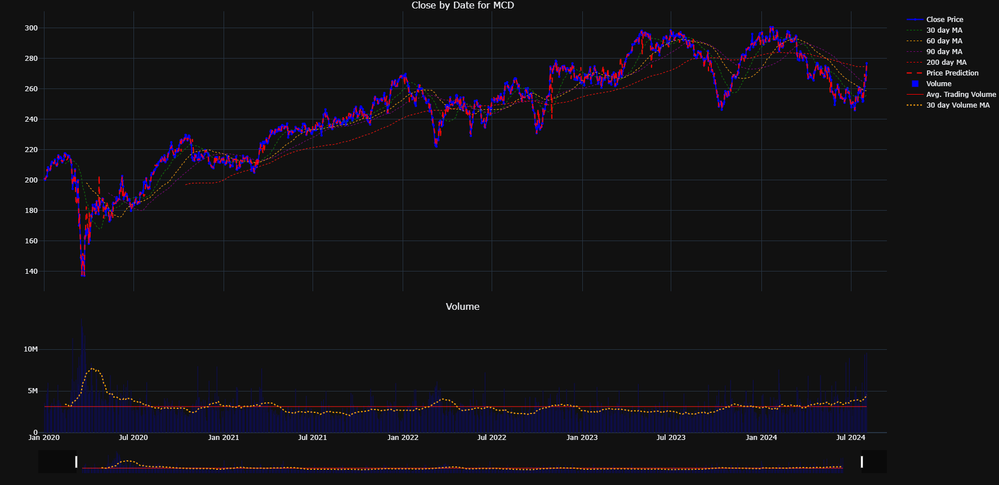

# Financial Stock Analysis

---
Since McDonalds is the barameters by which we judge the strength of global economy and the recent headlines of McDonalds missing their first earingins in years, I decided to do some anlaysis of my own. Using the Yahoo Finance API, I query basic metrics from the NYSE so I can perform the analysis. I also want to practice using the Plotly API for my visuals. Plotly is a fully interactive, highly customizable visual library that returns HTML visuals.

*I need to comeback and use an older version of plotly so I can display the html resutls. The new version requries a pro license*

## Query and EDA of stock data

```python
def pull_data(ticker, start_date, end_date):
    """
    Recieves the ticker, start & end date and returns NYSE data as a pandas dataframe
    
    Parameters:
    ticker: Company stock ticker for the NYSE as a string
    start_date: The desired start date as a string
    end_date: The desired end date as a string

    Returns:
    All of the parameters above as a string
    data: pandas.Dataframe containing NYSE data
    """
    
    stock_data = yf.download(tickers=ticker, start=start_date, end=end_date)
    data = pd.DataFrame(stock_data)

    return ticker, start_date, end_date, data


# MCD is the stock ticker for McDonalds
# Setting the end date as the most recent closing day of the stock market
ticker, start_date, end_date, data = pull_data(ticker='MCD', start_date='2020-01-02', end_date=datetime.today().strftime('%Y-%m-%d'))
data.head()
```

## Feature Engineering
```python
price_cols = data.select_dtypes(include=['float64']).columns

data['Daily Delta'] = data['Close'].pct_change() * 100
data['Daily Delta'] = data['Daily Delta'].round(2)

data = data.fillna(0)

data[price_cols] = data[price_cols].map(lambda x: round(x, 2))

moving_averages = 30, 60, 90, 200

for i in moving_averages:
    data[f'{i} day MA'] = data['Close'].rolling(i).mean().round(2)

df = data
df['year'] = df.index.year
df['month'] = df.index.month
df['day_of_month'] = df.index.day
df['day_of_week'] = df.index.dayofweek

df
```

## Model Prep

```python
ml_data = df.drop(columns=['Open', 'High', 'Low', 'Adj Close', '30 day MA', '60 day MA', '90 day MA', '200 day MA'])

X = ml_data.drop(columns='Close')
y = ml_data['Close']

# Split data into training and test sets. Setting the randome state at 42 for reproducability and setting the standard test size
X_train, X_test, y_train, y_test = train_test_split(X, y, random_state=42, test_size=0.2)


model = xgb.XGBRegressor()

model.fit(X_train, y_train)
preds = model.predict(X_test)
```

```python
# So we can easily reuse the model scoring code lets turn it into a function
def score_model(y_test, preds):
    
    mse = mean_squared_error(y_test, preds)
    rmse = root_mean_squared_error(y_test, preds)
    r2 = r2_score(y_test, preds)

    scores_dict = {
        'MSE': mse,
        'RMSE': rmse,
        'R2': r2
    }

    model_scores = pd.DataFrame(list(scores_dict.items()), columns=['Metric', 'Score'])

    return model_scores

base_model_scores = score_model(y_test, preds)

base_model_scores
```

## Evaluating the results

With a standard error of 5.35 right our of the box, I'm pretty impressed the model is so good. We might be overfitting the data so cross validation and further testing are required.

### Plotting the base model

```python
def plot_predictions(ticker, df):

    # Create subplots with shared x-axis
    fig = make_subplots(rows=2, cols=1, shared_xaxes=True,
                        row_heights=[0.7, 0.3], vertical_spacing=0.05,
                        subplot_titles=(f"Close by Date for {ticker}", "Volume"))

    # Add close price line plot
    fig.add_trace(go.Scatter(
        x=df.index, y=df['Close'], mode='lines+markers', name='Close Price',
        line=dict(width=2, color='blue'), marker=dict(size=4, color='blue')
    ), row=1, col=1)

    # Add moving averages with dotted lines
    fig.add_trace(go.Scatter(
        x=df.index, y=df['30 day MA'], mode='lines', name='30 day MA',
        line=dict(width=1, dash='dot', color='green')
    ), row=1, col=1)

    fig.add_trace(go.Scatter(
        x=df.index, y=df['60 day MA'], mode='lines', name='60 day MA',
        line=dict(width=1, dash='dot', color='orange')
    ), row=1, col=1)

    fig.add_trace(go.Scatter(
        x=df.index, y=df['90 day MA'], mode='lines', name='90 day MA',
        line=dict(width=1, dash='dot', color='purple')
    ), row=1, col=1)

    fig.add_trace(go.Scatter(
        x=df.index, y=df['200 day MA'], mode='lines', name='200 day MA',
        line=dict(width=1, dash='dot', color='red')
    ), row=1, col=1)

    # Add the prediction line
    fig.add_trace(go.Scatter(
        x=df.index, y=df['Price_Prediction'], mode='lines', name='Price Prediction',
        line=dict(width=2, dash='dash', color='red')
    ), row=1, col=1)

    # Add volume bar chart
    fig.add_trace(go.Bar(
        x=df.index, y=df['Volume'], name='Volume',
        marker=dict(color='blue')
    ), row=2, col=1)
    
    mean_volume = df['Volume'].mean()
    mean_volume_line = [mean_volume] * len(df.index)
    

    fig.add_trace(go.Scatter(
        x=df.index, y=mean_volume_line, mode='lines', name='Avg. Trading Volume',
        line=dict(width=1, color='red')
    ), row=2, col=1)

    df['30 day Volume MA'] = df['Volume'].rolling(window=30).mean()
    fig.add_trace(go.Scatter(
    x=df.index, y=df['30 day Volume MA'], mode='lines', name='30 day Volume MA',
    line=dict(width=2, dash='dot', color='orange')
    ), row=2, col=1)


    # Update layout to adjust figure size, add title, and add rangeslider
    fig.update_layout(
        width=1800,
        height=1000,
        showlegend=True,
        xaxis_rangeslider_visible=False,  # Disable the default rangeslider
        xaxis2_rangeslider_visible=True,  # Add a rangeslider to the second x-axis
        xaxis2_rangeslider_thickness=0.05,  # Adjust the thickness of the rangeslider
        title_x=0.5,
        template='plotly_dark'
    )

    fig.show()

plot_predictions(ticker, df)
```
The model can be seen as the red dotted across the close price, which is the solid blue line.

